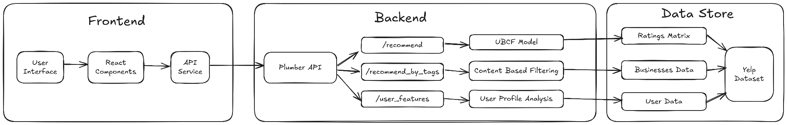
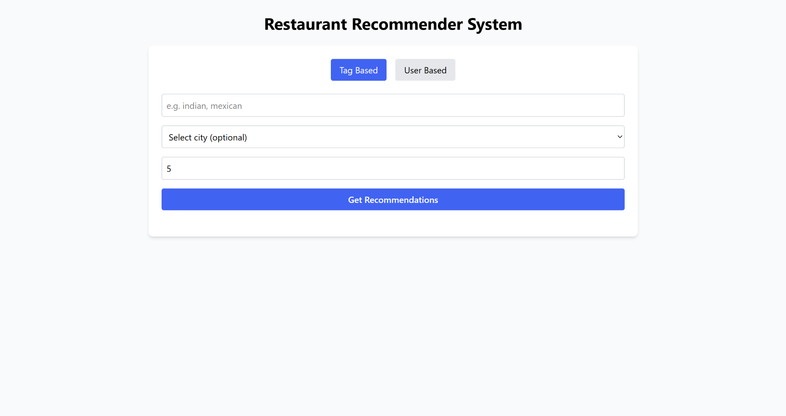
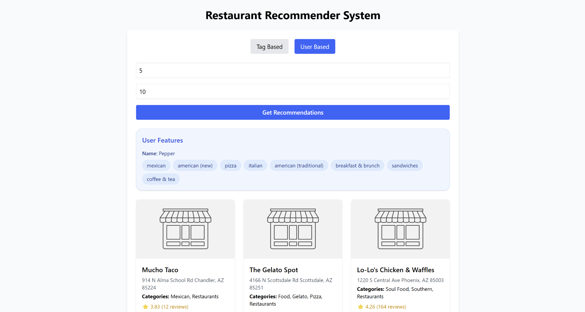

# Restaurant Recommendation System

This project implements a standalone **Restaurant Recommendation System** based on the **Yelp dataset**.

It utilizes:
- **User-Based Collaborative Filtering (UBCF)**
- **Content-Based Filtering** via keyword-based recommendations

---

## System Architecture



1. **Frontend**: React-based UI for user interaction  
2. **Backend API**: R-based Plumber server that processes requests and generates recommendations  
3. **Data Processing Layer**: R scripts for preprocessing and model training  
4. **Data Storage**: In-memory structures derived from preprocessed Yelp data  

## Technologies & Tools

### Languages & Libraries
- **R**
- **JavaScript/React**
- **Tailwind CSS**

### Tools
- R Studio
- Node.js
- Git

---

## Dataset

**Source**: [Yelp Dataset (RecSys Challenge 2013)](https://www.kaggle.com/competitions/yelp-recsys-2013)

### Components
- `business`: Name, categories, location
- `user`: User metadata
- `review`: Star ratings & text

### Stats (After Preprocessing)
- Restaurants: 3,865
- Users: 10,000
- Reviews: 39,551

---

## Recommendation Methods

### User-Based Collaborative Filtering
Implemented using `recommenderlab`:
```r
UB <- Recommender(ui_mat, "UBCF", param=list(normalize = "Z-score", method="Cosine"))
````

* Normalization: Z-score
* Similarity: Cosine
* Predicts and ranks restaurants not yet rated by the user

### Content-Based Filtering

Via `/recommend_by_tags` endpoint:

* Filters restaurants using keyword tags (e.g., "Indian", "buffet")
* Optionally filter by city
* Ranked by average rating and review count

---

## API Endpoints

### `/recommend` (POST)

**Params**:

* `user_id`
* `n` (default: 5)

**Returns**: Recommended restaurants for the user.

---

### `/recommend_by_tags` (POST)

**Params**:

* `tags`: e.g., `"indian, buffet"`
* `city_name` (optional)
* `n` (default: 5)

**Returns**: Restaurants matching tags, ranked by ratings.

---

### `/user_features` (GET)

**Params**:

* `user_index`: Internal ID

**Returns**: Top restaurant categories based on high-rated reviews.

---

## Images





---

## References

1. [RecSys Challenge 2013](https://www.kaggle.com/competitions/yelp-recsys-2013)
2. [RPubs - D612 Final Project](https://rpubs.com/jemceach/D612-Final-Project)